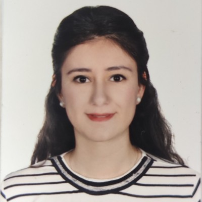

{fig-align="center" width="300"}

# *Eğitim*

-   B.S. Elektrik Elektronik Mühendisliği, Kırıkkale Üniversitesi, 2010 - 2015

-   M.S., Kalite ve Uygunluk Değerlendirme Mühendisliği, Hacettepe Hacettepe Üniversitesi, 2025 - Halen

# *İş Tecrübesi*

-   Üretim Müdürü - Konrul Teknoloji 2024 - Halen

-   Arge Mühendisi - Oplog 2018 - 2022

# Projects

# Publications

1.  Dasdemir, E., Batta, R., Koksalan, M., Tezcaner Ozturk, D. (2022) “UAV Routing for Reconnaissance Mission: A Multi-Objective Orienteering Problem with Time-Dependent Prizes and Multiple Connections”, Computers & Operations Research, 145: 105882.

# Competencies

# Hobbies
