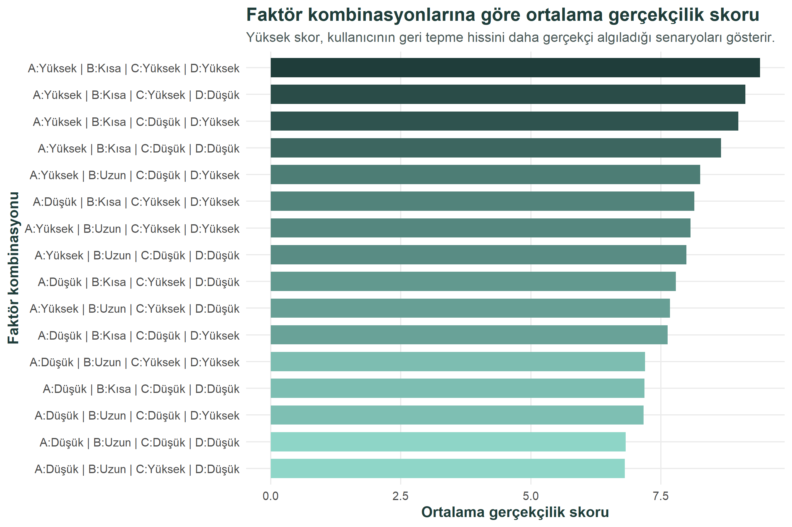
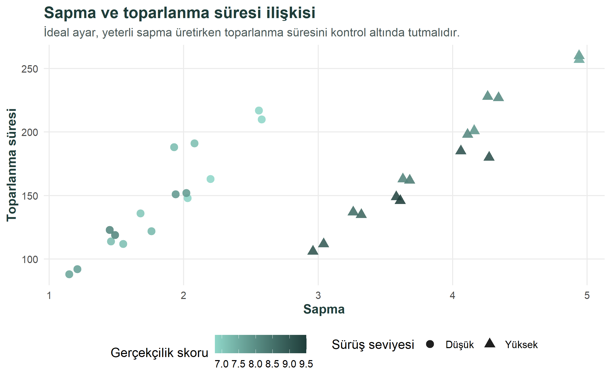
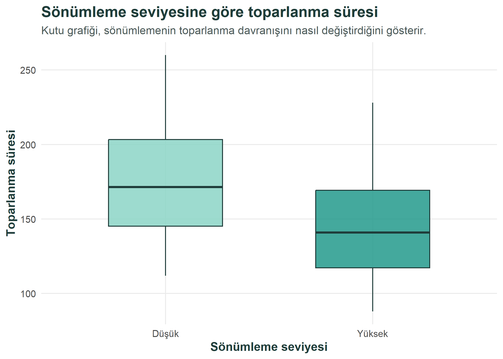
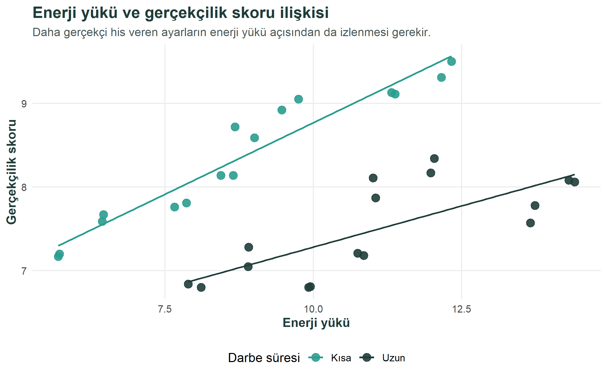
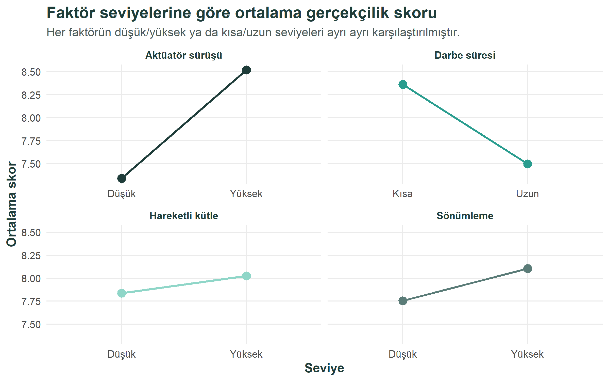
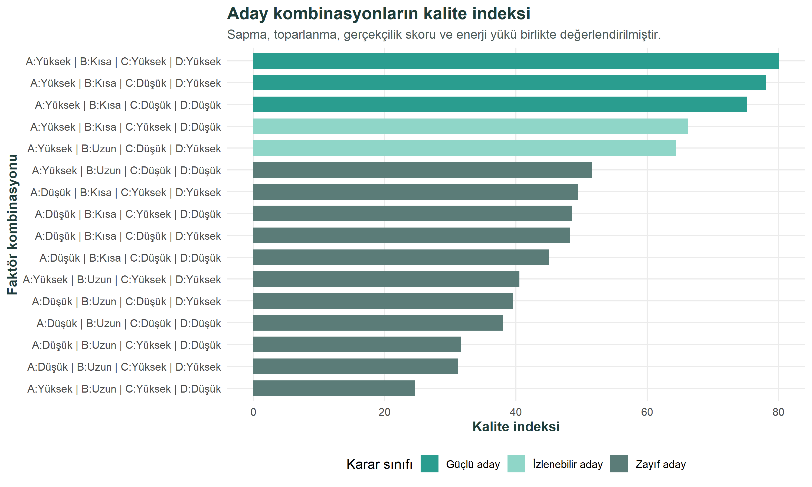

```{r}
#| label: kurulum
#| include: false

library(readr)
library(dplyr)
library(tidyr)
library(stringr)
library(ggplot2)

ham_veri <- read_csv("data/02_m4_sentetik_ham_veri.csv", show_col_types = FALSE)
veri <- read_csv("data/03_m4_temiz_veri.csv", show_col_types = FALSE)
uzun_veri <- read_csv("data/04_m4_uzun_veri.csv", show_col_types = FALSE)
degisken_ozeti <- read_csv("outputs/tables/01_degisken_ozeti.csv", show_col_types = FALSE)
faktor_ozetleri <- read_csv("outputs/tables/02_faktor_ozetleri.csv", show_col_types = FALSE)
kombinasyon_ozetleri <- read_csv("outputs/tables/03_kombinasyon_ozetleri.csv", show_col_types = FALSE)
karar_tablosu <- read_csv("outputs/tables/04_coklu_yanit_karar_tablosu.csv", show_col_types = FALSE)

tablo_html <- function(x, caption = NULL, digits = 2) {
  knitr::kable(
    x,
    format = "html",
    caption = caption,
    digits = digits,
    table.attr = 'class="table table-striped table-hover table-sm"'
  )
}

duzey_tr <- function(x) {
  dplyr::recode(x, "Dusuk" = "Düşük", "Yuksek" = "Yüksek", "Kisa" = "Kısa", "Uzun" = "Uzun")
}

ham_veri_tablo <- ham_veri |>
  transmute(
    `Deney sırası` = Run,
    `Standart sıra` = Std,
    `Tekrar` = Rep,
    `A - Aktüatör sürüşü` = duzey_tr(A),
    `B - Darbe süresi` = duzey_tr(B),
    `C - Hareketli kütle` = duzey_tr(C),
    `D - Sönümleme` = duzey_tr(D),
    `Sapma` = Sapma,
    `Toparlanma` = Toparlanma,
    `Gerçekçilik skoru` = Skor,
    `Enerji yükü` = Enerji
  )

veri_onizleme_tablo <- ham_veri_tablo |> head(8)

degisken_ozeti_tablo <- degisken_ozeti |>
  transmute(
    `Gözlem sayısı` = gozlem_sayisi,
    `Sapma ort.` = sapma_ortalama,
    `Sapma min.` = sapma_min,
    `Sapma maks.` = sapma_max,
    `Toparlanma ort.` = toparlanma_ortalama,
    `Toparlanma min.` = toparlanma_min,
    `Toparlanma maks.` = toparlanma_max,
    `Skor ort.` = skor_ortalama,
    `Skor min.` = skor_min,
    `Skor maks.` = skor_max,
    `Enerji ort.` = enerji_ortalama,
    `Enerji min.` = enerji_min,
    `Enerji maks.` = enerji_max
  )

faktor_ozetleri_tablo <- faktor_ozetleri |>
  mutate(
    faktor = recode(
      faktor,
      "A" = "Aktüatör sürüşü",
      "B" = "Darbe süresi",
      "C" = "Hareketli kütle",
      "D" = "Sönümleme"
    ),
    seviye = duzey_tr(seviye)
  ) |>
  transmute(
    `Faktör` = faktor,
    `Seviye` = seviye,
    `Ortalama sapma` = sapma_ort,
    `Ortalama toparlanma` = toparlanma_ort,
    `Ortalama skor` = skor_ort,
    `Ortalama enerji` = enerji_ort
  )

eksik_deger_tablo <- veri |>
  summarise(across(everything(), ~ sum(is.na(.x)))) |>
  pivot_longer(everything(), names_to = "Değişken", values_to = "Eksik değer sayısı")
```

```{=html}
<style>
:root {
  --m4-koyu: #1F3D3A;
  --m4-yesil: #2A9D8F;
  --m4-mint: #8FD6C8;
  --m4-acik: #D8F3EC;
  --m4-nötr: #5B7C78;
}

table.table {
  border: 1px solid rgba(31, 61, 58, 0.18);
  border-radius: 6px;
  overflow: hidden;
  font-size: 0.92rem;
}

table.table thead th {
  background: var(--m4-koyu);
  color: #ffffff;
  border-color: var(--m4-koyu);
}

table.table-striped > tbody > tr:nth-of-type(odd) > * {
  background-color: rgba(216, 243, 236, 0.60);
}

table.table-hover > tbody > tr:hover > * {
  background-color: rgba(143, 214, 200, 0.28);
}

caption {
  color: var(--m4-koyu);
  font-weight: 700;
}
</style>
```

# Proje Genel Bakış ve Kapsamı

Bu projede, mühimmat kullanmayan elektronik bir eğitim simülatöründe geri tepme davranışını temsil eden sentetik bir deney veri seti R programlama dili ile analiz edilmektedir. Elektronik eğitim simülatörlerinde temel amaç, kullanıcıya güvenli bir ortamda gerçekçi bir eğitim deneyimi sunmaktır. Bu tür sistemlerde geri tepme hissinin çok zayıf olması eğitim gerçekçiliğini azaltabilir; buna karşılık geri tepme davranışının çok sert, uzun süreli veya kontrolsüz olması kullanıcı deneyimini ve sistem güvenilirliğini olumsuz etkileyebilir.

Bu nedenle bu çalışmada geri tepme davranışı tek bir performans göstergesiyle değil, birden fazla kriterin birlikte değerlendirilmesiyle ele alınmıştır. Analizde sapma, toparlanma süresi, gerçekçilik skoru ve enerji yükü birlikte incelenmektedir. Sapma ve gerçekçilik skoru eğitim hissinin yeterliliğini temsil ederken, toparlanma süresi ve enerji yükü sistemin kontrol edilebilirliği ve uygulanabilirliği hakkında bilgi vermektedir.

Projenin temel karar sorusu şudur: Farklı faktör seviyeleri arasında, sentetik deney senaryosu içinde en dengeli geri tepme davranışını hangi ayar kombinasyonu sağlamaktadır? Bu soruya yanıt verebilmek için faktör seviyeleri arasındaki farklar özet tablolar, grafikler ve çoklu yanıt kalite indeksi yardımıyla incelenmiştir.

Çalışma kapsamında dört temel faktör ele alınmıştır: aktüatör sürüş seviyesi, darbe süresi, hareketli kütle seviyesi ve sönümleme seviyesi. Bu faktörlerin her biri iki seviyede değerlendirilmiş ve her kombinasyon için iki tekrar olacak şekilde toplam 32 gözlemden oluşan bir sentetik veri seti kullanılmıştır.

Çalışmanın ana odağı ileri istatistiksel testlerden çok, MUY665 dersinde işlenen iş analitiği sürecini uygulamaktır. Bu nedenle proje; veri okuma, veri düzenleme, keşifsel veri analizi, görselleştirme, özet tablo oluşturma ve karar desteği adımları üzerinden ilerlemektedir. R tarafında `readr`, `dplyr`, `tidyr`, `stringr` ve `ggplot2` paketleri kullanılarak ders notlarında yer alan temel veri analitiği yaklaşımları uygulanmıştır.

Veri seti sentetik/senaryo tabanlı olarak hazırlanmıştır, bulgular gerçek bir fiziksel sistemin kesin sonucu olarak yorumlanmamalıdır. Buna karşılık çalışma, gerçek test verisi elde edildiğinde aynı analiz akışının nasıl yeniden çalıştırılabileceğini gösteren tekrarlanabilir bir iş analitiği örneği sunmaktadır.

# Veri

## Veri Kaynağı

Bu çalışmada kullanılan veri seti gerçek saha veya test ölçümü değildir. Veri, mühimmat kullanmayan elektronik eğitim simülatörünün geri tepme davranışını temsil etmek amacıyla oluşturulmuş sentetik/senaryo tabanlı deney verisidir.

Bu nedenle bulgular, gerçek bir fiziksel sistemin kesin performans kanıtı olarak değil, R ile iş analitiği yöntemlerinin yeniden üretilebilir bir uygulaması olarak yorumlanmalıdır.

Veri kaynağının sentetik olarak seçilmesinin temel nedeni, gerçek bir prototip veya saha testinden ölçüm alınmamış olmasıdır. Bu durum, çalışmanın sınırlılığı olmakla birlikte aynı zamanda ders kapsamında öğrenilen R tabanlı veri analitiği sürecini kontrollü bir veri seti üzerinde uygulama olanağı sağlamaktadır. Bu nedenle veri seti, gerçek sistem davranışını birebir temsil eden bir ölçüm kaydı olarak değil, karar analitiği yaklaşımını göstermek için oluşturulmuş bir çalışma verisi olarak ele alınmıştır.

## Veri Hakkında Genel Bilgiler

Veri seti dört faktör ve dört yanıt değişkeninden oluşmaktadır. Dört faktörün her biri iki seviyede ele alınmış, her kombinasyon iki tekrar ile gözlemlenmiş ve toplam 32 gözlem elde edilmiştir.

Faktörler, sistem üzerinde değiştirilebilir ayarları temsil etmektedir:

-   `A - Aktüatör sürüş seviyesi`: Aktüatörün geri tepme etkisini oluşturmak için ne kadar güçlü çalıştırıldığını ifade eder. Düşük sürüş seviyesi daha yumuşak bir tepki üretirken, yüksek sürüş seviyesi daha belirgin bir geri tepme hissi oluşturabilir.
-   `B - Darbe süresi`: Geri tepme etkisinin ne kadar süreyle uygulandığını gösterir. Kısa darbe süresi daha ani ve kontrollü bir etkiyi, uzun darbe süresi ise daha yayılmış ve toparlanması daha zor olabilecek bir etkiyi temsil eder.
-   `C - Hareketli kütle seviyesi`: Simülatör içinde geri tepme hissini oluşturan hareketli parçanın kütle düzeyini temsil eder. Daha yüksek kütle, geri tepme hissini güçlendirebilir; ancak sistemin toparlanma davranışını da etkileyebilir.
-   `D - Sönümleme seviyesi`: Geri tepme sonrası hareketin ne kadar hızlı bastırıldığını veya dengelendiğini ifade eder. Yüksek sönümleme, sistemin daha kontrollü biçimde toparlanmasına yardımcı olabilir.

Yanıt değişkenleri ise her deney koşulunda sistemin nasıl davrandığını ölçmek için kullanılan performans göstergeleridir:

-   `Sapma`: Geri tepme sonrasında nişan hattında veya simülatör ekseninde oluşan sapma düzeyini temsil eder. Çok düşük sapma gerçekçilik hissini azaltabilir; çok yüksek sapma ise kontrolü zorlaştırabilir.
-   `Toparlanma`: Geri tepme etkisinden sonra sistemin yeniden kararlı hale gelmesi için gereken süreyi temsil eder. Daha düşük toparlanma süresi, kullanıcının bir sonraki harekete daha hızlı hazırlanabilmesi açısından avantajlıdır.
-   `Skor`: Geri tepme davranışının kullanıcı tarafından ne kadar gerçekçi algılanabileceğini temsil eden sentetik bir değerlendirme skorudur. Bu değişkende yüksek değer daha olumlu kabul edilmiştir.
-   `Enerji`: Geri tepme etkisini oluşturmak için gereken enerji yükünü temsil eder. Enerji değerinin çok yükselmesi, gerçek bir sistemde batarya tüketimi, ısınma veya mekanik zorlanma gibi konular açısından risk oluşturabilir.

Bu yapı, her faktör kombinasyonunun sistem davranışı üzerindeki etkisini karşılaştırmaya imkan verir. Örneğin yüksek sürüş seviyesi geri tepme hissini artırabilir; ancak aynı zamanda enerji yükünü veya toparlanma süresini de artırabilir. Benzer şekilde yüksek sönümleme, sistemin daha kontrollü toparlanmasına yardımcı olabilir fakat gerçekçilik algısı üzerindeki etkisi diğer faktörlerle birlikte değerlendirilmelidir. Bu nedenle veri seti, tek değişkenli bir sıralama yapmak yerine çok kriterli bir karar problemi olarak yorumlanmıştır.

```{r}
#| label: veri-yapisi
#| echo: false

tablo_html(veri_onizleme_tablo, "Veri setinden ilk sekiz gözlem")
```

## Veri Okuma ve Ön İşleme

Veriler CSV formatında R ortamına aktarılmıştır. Ders notlarında yer alan `readr`, `dplyr`, `tidyr` ve `stringr` paketleri kullanılarak veri okunmuş, faktör değişkenleri düzenlenmiş, kombinasyon etiketi oluşturulmuş ve grafikler için uzun formata çevrilmiştir.

Ön işleme aşamasında öncelikle veri setinde eksik değer olup olmadığı kontrol edilmiştir. Daha sonra `A`, `B`, `C` ve `D` değişkenleri karakter veri tipinden faktör yapısına dönüştürülmüştür. Bu dönüşüm önemlidir; çünkü bu değişkenler sayısal büyüklük değil, kategorik deney seviyelerini temsil etmektedir. Ayrıca grafiklerde ve özet tablolarda daha okunabilir bir yapı elde etmek için her satırda faktör kombinasyonunu gösteren ek bir etiket oluşturulmuştur.

Grafik ve özet analizlerde daha esnek çalışabilmek için veri seti uzun formata da çevrilmiştir. Böylece `Sapma`, `Toparlanma`, `Skor` ve `Enerji` değişkenleri aynı yapı içinde karşılaştırılabilir hale getirilmiştir. Bu adım, ders notlarında anlatılan tidy data yaklaşımına uygun bir düzenleme adımıdır.

Aşağıdaki tablo, analizde kullanılan 32 gözlemli ham sentetik veri setinin tamamını göstermektedir. Tabloda her satır bir deney koşulunu; faktör sütunları ilgili ayarı; son dört sütun ise bu ayar altında elde edilen sentetik yanıt değerlerini göstermektedir.

```{r}
#| label: ham-veri-tablosu
#| echo: false

tablo_html(ham_veri_tablo, "Analizde kullanılan ham sentetik veri seti")
```

```{r}
#| label: veri-on-isleme-kodu

veri_ornek <- read_csv("data/03_m4_temiz_veri.csv", show_col_types = FALSE)

veri_ornek <- veri_ornek |>
  mutate(
    A = factor(A, levels = c("Dusuk", "Yuksek")),
    B = factor(B, levels = c("Kisa", "Uzun")),
    C = factor(C, levels = c("Dusuk", "Yuksek")),
    D = factor(D, levels = c("Dusuk", "Yuksek")),
    kombinasyon = str_c("A=", A, " | B=", B, " | C=", C, " | D=", D)
  )

eksik_deger_tablo |>
  tablo_html("Ön işleme sonrası eksik değer kontrolü")
```

# Keşifsel Veri Analizi

İlk adımda veri setinin genel yapısı ve sayısal değişkenlerin temel özetleri incelenmiştir. Bu adım, hangi değişkenlerin karar açısından daha belirleyici olabileceğini anlamak için kullanılmıştır.

Keşifsel veri analizi, bu projede yalnızca tablo üretmek için değil, sonraki grafik ve karar adımlarını yönlendirmek için kullanılmıştır. Ortalama, minimum ve maksimum değerler incelenerek değişkenlerin hangi aralıkta değiştiği görülmüştür. Böylece örneğin gerçekçilik skoru yüksek olan ayarların enerji yükü bakımından da kabul edilebilir olup olmadığı tartışılabilir hale gelmiştir.

```{r}
#| label: degisken-ozeti
#| echo: false

tablo_html(degisken_ozeti_tablo, "Sayısal değişkenlerin genel özeti")
```

Faktör seviyelerine göre ortalamalar incelendiğinde, özellikle sürüş seviyesi ve darbe süresinin sapma, toparlanma ve gerçekçilik skoru üzerinde belirgin farklar oluşturduğu görülmektedir.

Bu tablo, her faktörün tek başına ortalama etkisini görmeye yardımcı olur. Ancak faktörlerin birlikte çalıştığı unutulmamalıdır. Bir ayarın iyi veya kötü olarak sınıflandırılması yalnızca sürüş seviyesi ya da darbe süresine bağlı değildir; kütle ve sönümleme seviyesi de sonuçları değiştirebilir. Bu nedenle grafiklerle analiz bölümünde değişkenler birlikte yorumlanmıştır.

```{r}
#| label: faktor-ozetleri
#| echo: false

tablo_html(faktor_ozetleri_tablo, "Faktör seviyelerine göre ortalama yanıtlar")
```

Bu bölümdeki tablolar, Grafik 1'in temelini oluşturmaktadır. Önce her faktör seviyesi ve her kombinasyon için sapma, toparlanma, gerçekçilik skoru ve enerji değerleri özetlenmiştir. Daha sonra özellikle `Skor` değişkeni kullanılarak her faktör kombinasyonunun ortalama gerçekçilik skoru hesaplanmıştır. Grafik 1, bu hesaplanan ortalama gerçekçilik skorlarını görselleştirerek hangi ayar kombinasyonlarının kullanıcı algısı açısından daha güçlü göründüğünü karşılaştırmalı biçimde göstermektedir.

# Grafiklerle Analiz

Bu bölümde grafiklerde ve tablolarda ortak bir yeşil/teal renk standardı kullanılmıştır. Koyu yeşil ana vurgu ve başlık rengini, canlı yeşil güçlü sonuçları, mint tonu orta seviyedeki durumları, nötr yeşil-gri ton ise daha düşük performans gösteren adayları temsil etmektedir. Böylece farklı grafiklerde kullanılan renklerin aynı görsel dil içinde okunması amaçlanmıştır.

## Grafik 1: Faktör Kombinasyonlarına Göre Gerçekçilik Skoru

Grafiklerde kullanılan kısaltmalar veri setindeki faktörleri temsil etmektedir: `A` aktüatör sürüş seviyesini, `B` darbe süresini, `C` hareketli kütle seviyesini ve `D` sönümleme seviyesini ifade etmektedir. Örneğin `A:Yüksek | B:Kısa | C:Yüksek | D:Yüksek` ifadesi; aktüatör sürüşünün yüksek, darbe süresinin kısa, hareketli kütlenin yüksek ve sönümlemenin yüksek olduğu ayar kombinasyonunu göstermektedir.

```{r}
#| label: grafik-1
#| echo: false
#| fig-cap: "Faktör kombinasyonlarına göre ortalama gerçekçilik skoru"


```

Bu grafik, gerçekçilik skorunun faktör kombinasyonlarına göre değiştiğini göstermektedir. En yüksek skorlar genellikle sürüş seviyesinin yüksek ve darbe süresinin kısa olduğu kombinasyonlarda ortaya çıkmaktadır. Bu durum, sentetik senaryoda geri tepme hissinin güçlü fakat kontrol edilebilir olduğu ayarların daha olumlu değerlendirildiğini göstermektedir.

Grafik aynı zamanda tüm kombinasyonların birbirine yakın performans göstermediğini de ortaya koymaktadır. Bazı ayarlar yüksek gerçekçilik sağlarken bazıları belirgin biçimde geride kalmaktadır. Bu fark, karar vericinin yalnızca faktör seviyelerini tek tek değil, kombinasyon mantığıyla değerlendirmesi gerektiğini göstermektedir.

Grafik 1'de üst sıralarda yer alan kombinasyonlar incelendiğinde, yüksek aktüatör sürüş seviyesinin gerçekçilik algısını artıran önemli bir unsur olduğu görülmektedir. Ancak yalnızca sürüş seviyesinin yüksek olması yeterli değildir; darbe süresinin kısa olması da ayarın daha dengeli algılanmasına katkı sağlamaktadır. Uzun darbe süresi kullanılan bazı kombinasyonlarda gerçekçilik skoru düşmektedir. Bu durum, geri tepme etkisinin güçlü olmasının yanında süresinin de kontrol edilebilir olması gerektiğini göstermektedir.

Kütle ve sönümleme seviyeleri ise üst sıralardaki kombinasyonların kendi içindeki sıralamasını değiştirmektedir. Özellikle yüksek sönümleme, geri tepme sonrası sistemin daha kontrollü davranmasına katkı sunduğu için gerçekçilik algısını dolaylı olarak destekleyebilir. Bu nedenle Grafik 1, tek bir faktörün etkisinden çok faktörlerin birlikte oluşturduğu ayar profilinin önemli olduğunu göstermektedir.

## Grafik 2: Sapma ve Toparlanma Süresi İlişkisi

```{r}
#| label: grafik-2
#| echo: false
#| fig-cap: "Sapma ve toparlanma süresi ilişkisi"


```

Sapma ile toparlanma süresi birlikte incelendiğinde, daha yüksek sapma üreten ayarların her zaman daha iyi olmadığı görülmektedir. Çünkü yüksek sapma, toparlanma süresini uzatarak kullanıcı kontrolünü zorlaştırabilir. Bu nedenle karar yalnızca tek bir değişkene göre verilmemelidir.

Bu grafik iş analitiği açısından önemli bir denge problemini göstermektedir. Eğitim simülatöründe sapmanın çok düşük olması gerçekçilik hissini zayıflatabilir; ancak sapmanın çok yüksek olması da kullanıcının hedefe geri dönmesini zorlaştırabilir. Bu nedenle ideal ayar, yüksek sapma üreten değil, yeterli sapma ile makul toparlanma süresini birlikte sağlayan ayardır.

Grafik 2'de noktaların konumu, her deney koşulunda sapma ve toparlanma süresinin birlikte nasıl değiştiğini göstermektedir. Renk tonları gerçekçilik skorunu temsil ettiği için yalnızca eksenlere değil, noktanın rengine de bakmak gerekir. Daha koyu renkli noktalar daha yüksek gerçekçilik skoruna karşılık gelmektedir. Bu sayede, yüksek gerçekçilik skoru sağlayan ayarların aynı zamanda kabul edilebilir toparlanma süresine sahip olup olmadığı görsel olarak değerlendirilebilir.

Grafikte görülen temel çıkarım, kararın tek boyutlu olmadığıdır. Sağ tarafa doğru gidildikçe sapma artmakta, yukarı doğru gidildikçe toparlanma süresi uzamaktadır. İdeal bölge, çok düşük sapmanın olmadığı fakat toparlanma süresinin de aşırı yükselmediği orta-üst denge alanıdır. Bu nedenle Grafik 2, sonraki çoklu yanıt kalite indeksinin neden gerekli olduğunu desteklemektedir: çünkü gerçekçilik, sapma ve toparlanma aynı anda değerlendirilmeden güvenilir bir karar önerisi üretmek zordur.

## Grafik 3: Sönümleme Seviyesine Göre Toparlanma Süresi

```{r}
#| label: grafik-3
#| echo: false
#| fig-cap: "Sönümleme seviyesine göre toparlanma süresi"


```

Boxplot grafiği, sönümleme seviyesinin toparlanma süresi üzerindeki etkisini görsel olarak karşılaştırmaktadır. Yüksek sönümleme seviyesi, geri tepme sonrası sistemin daha kontrollü davranmasına yardımcı olan bir faktör olarak yorumlanabilir.

Kutu grafiği dağılımı göstermesi açısından özellikle yararlıdır. Sadece ortalamaya bakmak yerine, toparlanma süresinin hangi aralıkta değiştiği ve değerlerin ne kadar yayıldığı görülebilir. Bu da karar sürecinde kararlılık ve tutarlılık açısından ek bilgi sağlar.

## Grafik 4: Enerji Yükü ve Gerçekçilik Skoru İlişkisi

```{r}
#| label: grafik-4
#| echo: false
#| fig-cap: "Enerji yükü ve gerçekçilik skoru ilişkisi"


```

Enerji yükü ile gerçekçilik skoru arasında doğrudan ve tek yönlü bir karar vermek uygun değildir. Bazı ayarlar daha yüksek gerçekçilik skoru üretse de enerji yükü de artabilmektedir. Bu nedenle proje kapsamında enerji yükü, karar skorunda dengeleyici bir kriter olarak ele alınmıştır.

Bu bölümde amaç, "en gerçekçi his" ile "uygulanabilir enerji yükü" arasındaki ilişkiyi tartışmaktır. Gerçek bir sistemde enerji yükünün artması batarya kullanımı, aktüatör ısınması veya uzun dönem güvenilirlik gibi konularda risk oluşturabilir. Bu nedenle gerçekçilik skoru yüksek olan bir ayar, enerji yükü çok yüksekse doğrudan en iyi seçenek olarak kabul edilmemelidir.

## Grafik 5: Faktör Seviyelerine Göre Ortalama Skor

```{r}
#| label: grafik-5
#| echo: false
#| fig-cap: "Faktör seviyelerine göre ortalama gerçekçilik skoru"


```

Bu grafik, her faktörün seviyelerine göre ortalama gerçekçilik skorunu göstermektedir. Ders notlarında vurgulanan görselleştirme prensiplerine uygun olarak, kategorik seviyeler grafik üzerinden karşılaştırılmış ve karar açısından anlamlı farklar aranmıştır.

Grafik, faktör seviyelerinin etkisini sade bir biçimde okumaya yardımcı olur. Bu tür bir görselleştirme, karar vericiye hangi faktörlerin daha dikkatle izlenmesi gerektiğini gösterir. Özellikle gerçekçilik skoru açısından güçlü görünen seviyeler, sonraki çoklu yanıt değerlendirmesinde diğer kriterlerle birlikte yeniden ele alınmıştır.

# Çoklu Yanıt Değerlendirmesi

Tek bir performans göstergesine bakmak yerine sapma, toparlanma süresi, gerçekçilik skoru ve enerji yükü birlikte değerlendirilmiştir. Bu amaçla her aday kombinasyon için 0-100 aralığında bir kalite indeksi hesaplanmıştır.

Kalite indeksinde amaç, farklı yönlerde yorumlanan değişkenleri ortak bir karar ölçüsüne dönüştürmektir. Gerçekçilik skorunun yüksek olması olumlu kabul edilirken, toparlanma süresi ve enerji yükünün daha düşük olması tercih edilmiştir. Sapma için ise hedefe yakınlık mantığı kullanılmıştır; çünkü sapmanın ne çok düşük ne de aşırı yüksek olması istenmektedir.

```{r}
#| label: karar-tablosu
#| tbl-cap: "Kalite indeksine göre en iyi aday kombinasyonlar"

karar_tablosu |>
  select(kombinasyon_kisa, sapma_ort, toparlanma_ort, skor_ort, enerji_ort, kalite_indeksi, karar_sinifi) |>
  head(8) |>
  rename(
    `Faktör kombinasyonu` = kombinasyon_kisa,
    `Ortalama sapma` = sapma_ort,
    `Ortalama toparlanma` = toparlanma_ort,
    `Ortalama skor` = skor_ort,
    `Ortalama enerji` = enerji_ort,
    `Kalite indeksi` = kalite_indeksi,
    `Karar sınıfı` = karar_sinifi
  ) |>
  tablo_html("Kalite indeksine göre en iyi aday kombinasyonlar")
```

```{r}
#| label: grafik-6
#| echo: false
#| fig-cap: "Çoklu yanıt kalite indeksine göre aday kombinasyonlar"


```

Çoklu yanıt kalite indeksine göre en güçlü aday kombinasyon `A=Yuksek`, `B=Kisa`, `C=Yuksek`, `D=Yuksek` olarak belirlenmiştir. Bu ayar, sentetik senaryo içinde yüksek gerçekçilik skoru sağlarken sapma, toparlanma ve enerji yükü arasında daha dengeli bir sonuç vermektedir.

İlk üç adayın tamamında sürüş seviyesinin yüksek ve darbe süresinin kısa olması dikkat çekicidir. Bu sonuç, sentetik senaryoda güçlü fakat kısa süreli bir etkinin daha avantajlı olduğunu düşündürmektedir. Bununla birlikte kütle ve sönümleme seviyeleri adayların sıralamasını değiştirmektedir. Bu nedenle karar önerisi tek bir faktöre indirgenmemiş, tüm yanıtların birlikte değerlendirildiği kalite indeksi üzerinden yapılmıştır.

# Sonuçlar ve Ana Çıkarımlar

Bu çalışmada M4 elektronik eğitim simülatörü için sentetik deney verisi üzerinden R tabanlı bir iş analitiği akışı kurulmuştur. Veri okuma, düzenleme, özetleme, görselleştirme ve çoklu kriterli karar skoru adımları birlikte kullanılmıştır.

Ana çıkarımlar:

-   En yüksek geri tepme hissi her zaman en iyi ayar anlamına gelmemektedir.
-   Toparlanma süresi ve enerji yükü karar sürecinde mutlaka dikkate alınmalıdır.
-   Sentetik senaryo içinde en dengeli aday `A=Yuksek`, `B=Kisa`, `C=Yuksek`, `D=Yuksek` kombinasyonudur.
-   R ile hazırlanan bu analiz akışı, gerçek test verisi elde edildiğinde aynı şekilde tekrar çalıştırılabilir.

Genel olarak bu çalışma, iş analitiği yaklaşımının yalnızca geçmiş verileri özetlemekten ibaret olmadığını göstermektedir. Veri düzenleme, görselleştirme ve karar skoru adımları birlikte kullanıldığında, karmaşık görünen teknik bir problem daha anlaşılır bir karar problemine dönüştürülebilmektedir. Bu yönüyle proje, MUY665 dersinde ele alınan tanımlayıcı analitik ve karar desteği yaklaşımını uygulamalı bir örnek üzerinden göstermektedir.

# Kısıtlar ve Etik Not

Bu çalışma gerçek saha veya laboratuvar test verisi içermemektedir. Veri seti sentetik/senaryo tabanlı olduğu için bulgular gerçek bir fiziksel sistemin kesin performans kanıtı olarak yorumlanmamalıdır. Gerçek uygulama için pilot test, ölçüm sistemi analizi ve fiziksel doğrulama gereklidir.

Bu proje kapsamında yapay zeka desteği; proje planının düzenlenmesi, R kod akışının yapılandırılması, Quarto rapor taslağının hazırlanması ve yazılı anlatımın iyileştirilmesi amacıyla kullanılmıştır.

# Kaynaklar

-   MUY665 İş Analitiği ders notları, 2025-2026 Bahar Dönemi.
-   MUY665 2023-2024 Bahar dönemi örnek proje sayfaları.
-   Quarto dokümantasyonu: <https://quarto.org/>
-   R paketleri: `readr`, `dplyr`, `tidyr`, `stringr`, `ggplot2`.
